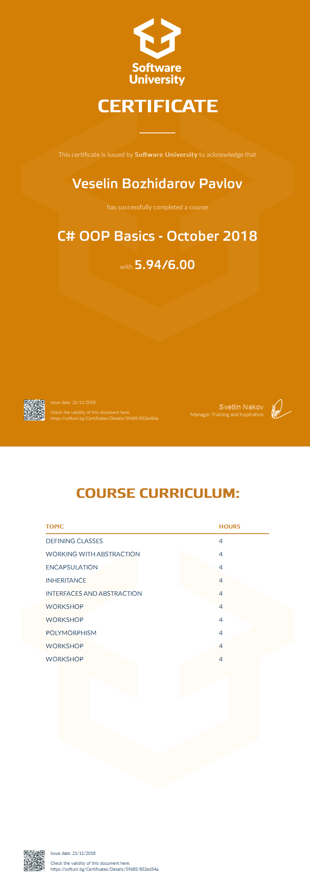

# Course: C# OOP Basics

## Topics:
01. Defining Classes
02. Working with Abstraction
03. Encapsulation
04. Inheritance
05. Interfaces and Abstraction
06. Polymorphism

## Status: 
Completed

## Certificate: 

